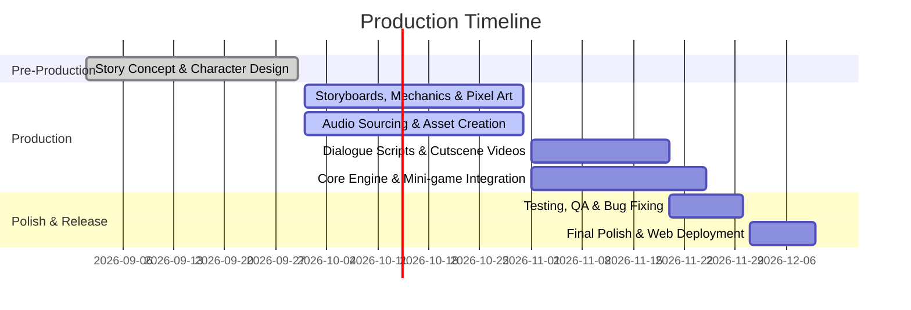

# The Rosalind Franklin Story

> An interactive storytelling puzzle game recreating the life, laboratory trials, and groundbreaking scientific contributions of Rosalind Franklin.

[](#production-timeline)
[](#project-overview)
[](#game-mechanics)
[](#team-information--task-distribution)

---

## Table of Contents

- [I. Project Overview](#i-project-overview)
  - [Format](#format)
  - [Core Game Mechanics](#core-game-mechanics)
  - [Medium Justification](#medium-justification)
- [II. The Communication Problem](#ii-the-communication-problem)
- [III. Target Audience & Communication Goals](#iii-target-audience--communication-goals)
- [IV. Team Information & Task Distribution](#iv-team-information--task-distribution)
- [V. Production Timeline](#v-production-timeline)
- [VI. Project Structure](#vi-project-structure)
- [VII. Getting Started](#vii-getting-started)
- [VIII. References & Sources](#viii-references--sources)

---

## I. Project Overview

### Format
**The Rosalind Franklin Story** is a storytelling puzzle game where players take on the role of biophysicist and X-ray crystallographer **Rosalind Franklin**. Players navigate her scientific journey, reconstructing her laboratory experiments and seminal contributions to molecular biology—most notably her role in capturing the historic **Photograph 51** and deciphering the double-helix structure of DNA.

### Core Game Mechanics
The core gameplay draws inspiration from Daniel Benmergui's ***Storyteller*** (published by Netflix), wherein players drag and arrange characters, laboratory equipment, actions, and settings inside comic panels to construct narrative and experimental scenes.

To deepen engagement and learning, the game incorporates three auxiliary mechanisms:

1. **Animated Cutscenes**:
   - Played at the conclusion of each chapter to summarize milestones and convey broader institutional, historical, and social context.
   - Features light, interactive touchpoints during playback to keep players actively involved.
2. **Scientific Literacy in Items & Interactive Lab Notebook**:
   - Scientific annotations and tooltips display practical explanations when hovering over experimental apparatus.
   - Players unlock an in-game achievement notebook pairing pixel-art illustrations with authentic archival photographs of Franklin’s actual laboratory apparatus and diffraction patterns.
3. **Lab Room Search Mini-Games**:
   - If players encounter missing equipment or cannot resolve a story frame, a laboratory instructor guides them to an exploratory room-puzzle mini-game.
   - Players inspect Franklin’s laboratory workspace to discover and retrieve the necessary scientific instruments.

### Medium Justification
- **Proven Genre Appeal**: Puzzle games with panel-arranging mechanics (*Storyteller*) have reached millions of players, displaying sustained engagement, positive community sentiment, and high viral potential.
- **Active vs. Passive Learning**: Educational research demonstrates that interactive problem-solving yields knowledge retention rates between **25%–60%**, compared to only **8%–10%** for passive video instruction.
- **Museum-Lab Experience**: Blending game mechanics with authentic archival photos creates an interactive "living museum", proven by serious-games research to foster deeper emotional connection and lasting comprehension of complex scientific processes.

---

## II. The Communication Problem

While DNA and the double helix are widely recognized—and Watson and Crick frequently celebrated—Rosalind Franklin’s critical contributions and her mastery in capturing Photograph 51 remain underappreciated in popular culture. Because the Nobel Prize was awarded posthumously, mainstream historical narratives have often disproportionately credited male counterparts, reinforcing persistent gender biases in STEM.

Furthermore, popular media frequently romanticizes scientific discovery as instantaneous "eureka" moments, obscuring the meticulous rigor, systematic trials, and resilience demanded by experimental research.

**Our Objective**: Restore Rosalind Franklin to her rightful place in scientific history while faithfully showcasing the iterative, empirical reality of laboratory science.

---

## III. Target Audience & Communication Goals

### Target Audience
- **Primary Audience**: Teenagers and young adults (ages 15–25) interested in indie and narrative-driven puzzle games.
- **Secondary Audience**: Students and educators exploring biology, genetics, and the history of science.

### Why this audience?
- Indie game enthusiasts actively seek innovative, mechanically distinct experiences and value narrative depth and thematic ambition over AAA graphical fidelity.
- Students in this demographic are introduced to DNA structure in curricula, yet standard textbooks frequently under-represent Franklin’s specific methodologies and Photograph 51.

### Communication Goals
| Goal Dimension | Intended Outcome |
| :--- | :--- |
| **Equity & Historical Recognition** | Elevate Franklin's vital leadership and research into public consciousness, normalizing historical representation of female pioneers in STEM. |
| **Attitudinal Impact** | Demystify scientific history for non-specialist youth, demonstrating that empirical research is creative, accessible, and thrilling. |
| **Knowledge Retention** | Build scientific literacy regarding X-ray crystallography, genetic research procedures, and Franklin's concrete discoveries. |

---

## IV. Team Information & Task Distribution

### Team J

| Member | Student ID | Primary Responsibilities |
| :--- | :--- | :--- |
| **Le Nguyen Nguyen Thao** | 2699063 | Core game design, game engine programming, mini-game coding, web build & publishing |
| **Lee Yoona** | 2421060 | Pixel art assets (characters, sprites), gameplay storyboards |
| **Zhang Yulin** | 2494118 | Narrative plot, dialogue scripts, tutorial text, Cutscene 1 illustrations |
| **Lee Seoyun** | 2490053 | Lab backgrounds, research item assets, sound effects (SFX), background music (BGM) |
| **Greta Schmedes** | IES26575 | Mini-game puzzle mechanics, Cutscene 2 illustrations, cover art, logo design |
| **Entire Team** | — | Concept brainstorming, cross-disciplinary design reviews, playtesting & bug fixing |

---

## V. Production Timeline



- **September**: Finalize narrative concept, historical research, and initial character designs.
- **October**: Complete gameplay storyboards, core panel mechanics, pixel art assets, and audio sourcing.
- **November**: Finalize dialogue scripts, implement room puzzle mini-games, lab backgrounds, animated cutscenes, and begin internal QA.
- **Early December**: Final balance polish, accessibility review, and public web release.

---

## VI. Project Structure

```text
mts/
├── docs/                               # Design documents, research & narrative scripts
│   ├── Project Proposal.docx           # Original team proposal document
│   ├── gdd/                            # Game Design Documents (rules, flow, mechanics)
│   ├── references/                     # Historical archives, lab photos, Photo 51 data
│   ├── scriptwriting/                  # Dialogue scripts, tutorial dialogues
│   └── storyboards/                    # Gameplay panels & cutscene storyboards
│
├── assets/                             # Raw & optimized game media
│   ├── art/                            # Visual assets
│   │   ├── characters/                 # Pixel-art sprites (Franklin, colleagues)
│   │   ├── comics/                     # Comic frame panels, scene environments
│   │   ├── items/                      # Lab equipment, draggable props
│   │   ├── backgrounds/                # Laboratory & historical environments
│   │   ├── historical_archive/         # Real archival photographs (unlockable museum)
│   │   └── ui/                         # HUD, icons, logos, cover art
│   ├── cutscenes/                      # Post-chapter animated cutscenes
│   │   ├── cutscene_1/                 # Chapter 1 animation & illustration assets
│   │   └── cutscene_2/                 # Chapter 2 animation & illustration assets
│   └── audio/                          # Sound design
│       ├── bgm/                        # Background music (menu, lab, comic panels)
│       ├── sfx/                        # Interactive audio (click, drag-drop, success)
│       └── voice/                      # Voiceovers & narration tracks
│
├── src/                                # Game source code
│   ├── core/                           # Lifecycle, state & audio managers
│   ├── mechanics/                      # Core gameplay logic
│   │   ├── storytelling/               # Storyteller drag-and-drop & panel validator
│   │   ├── minigames/                  # Room inspection & hidden object system
│   │   └── cutscenes/                  # Interactive cutscene controllers
│   ├── ui/                             # UI overlays, tooltips & achievement book
│   └── scenes/                         # Boot, Main Menu, Chapter Select & Main Gameplay
│
├── data/                               # Game data & balance configurations
│   ├── chapters/                       # Chapter narrative schemas (JSON/YAML)
│   ├── item_literacy.json              # Educational apparatus annotations & lore
│   ├── achievements.json               # Achievement definitions & archival pairings
│   └── localization/                   # Multilingual text strings (en.json, vi.json, ...)
│
├── build/                              # Web production output
│   └── index.html                      # Web build entrypoint
│
├── .gitignore                          # Git ignore rules for Web/JS projects
├── package.json                        # Project dependencies & build scripts
└── README.md                           # Project documentation & overview
```

---

## VII. Getting Started

### Prerequisites
- [Node.js](https://nodejs.org/) (version 18.x or later recommended)
- `npm` (bundled with Node.js)
- A modern web browser supporting WebGL and ES6 modules

### Setup & Run
```bash
# 1. Clone the repository
git clone https://github.com/nguyenthao-xinhgai/mts.git

# 2. Navigate to project root
cd mts

# 3. Install project dependencies
npm install

# 4. Start the local development server
npm run dev
```

### Building for Production
```bash
# Bundle web distribution into build/
npm run build
```

---

## VIII. References & Sources

1. SteamDB. *Puzzle Games on Steam Analytics*.
2. GameDiscoverCo. *The State of Steam Wishlist Conversions (2024–2025)*.
3. YouTube Game Analytics. *Storyteller Gameplay Virality and Engagement*.
4. *Enhancing Self-Directed Learning in Science Education: The Impact of Puzzle-Solving Games and Video-Based Materials on Understanding the Origin of Electricity*.
5. *Why Interactive E-Learning Outperforms Passive Video-Based Learning: Comparative Cognitive Retention Studies*.
6. *Serious Games in Science Education: A Systematic Bibliometric and Content Analysis*.
7. 80 Level Research. *Heavy Indie Gamers: Demographics, Tastes, and Player Behavior*.
8. Science History Institute & King's College London Archives. *The Story Behind Photograph 51 and Rosalind Franklin's Legacy*.
